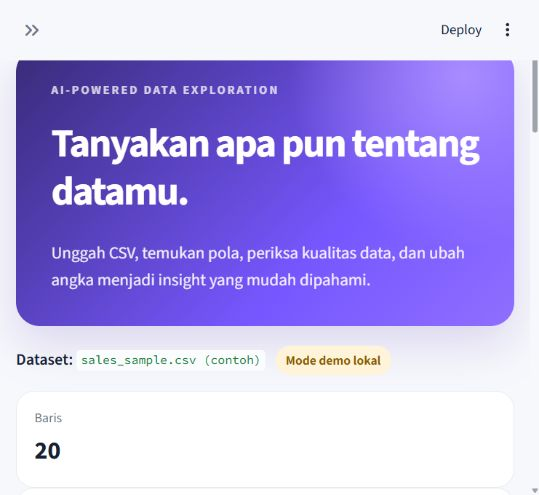
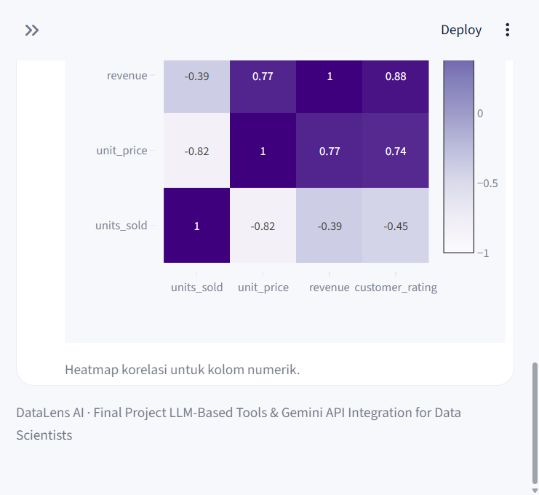
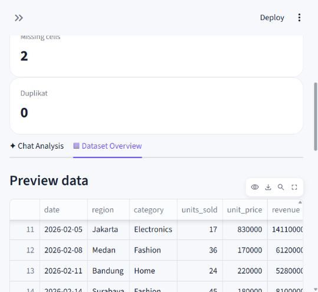

# DataLens AI

DataLens AI adalah chatbot analisis data berbasis Gemini API. Pengguna dapat mengunggah CSV, memeriksa kualitas data, bertanya menggunakan bahasa alami, dan membuat visualisasi tanpa menulis kode.

> Final Project — **LLM-Based Tools and Gemini API Integration for Data Scientists**

## Tampilan aplikasi



| Chat dengan heatmap | Dataset overview |
|---|---|
|  |  |

## Fitur

- Upload dan preview dataset CSV.
- Ringkasan baris, kolom, missing values, duplikat, dan statistik numerik.
- Chat analisis dengan Gemini Interactions API.
- Memory percakapan melalui `previous_interaction_id`.
- Parameter kreatif: bahasa, gaya, tingkat pengguna, panjang jawaban, dan temperature.
- Visualisasi otomatis: histogram, scatter plot, box plot, dan correlation heatmap.
- Fallback analysis engine lokal agar demo tetap berjalan tanpa API key.
- API key hanya dibaca dari environment atau input password selama sesi.

## Arsitektur

```text
Pengguna
   │
   ▼
Streamlit UI ─────── Dataset Overview
   │
   ├── pandas analysis engine ── Plotly chart
   │
   └── Gemini service ────────── Gemini Interactions API
          │
          └── system instruction + dataset summary + chat memory
```

Hanya skema, statistik ringkas, dan lima contoh baris yang dikirim sebagai konteks ke Gemini. Seluruh dataset tidak dikirim.

## Menjalankan aplikasi

Persyaratan: Python 3.10 atau lebih baru.

```bash
python -m venv .venv
```

Aktifkan virtual environment:

```powershell
.venv\Scripts\Activate.ps1
```

```bash
pip install -r requirements.txt
copy .env.example .env
streamlit run app.py
```

Buka `http://localhost:8501`.

API key dapat dibuat melalui [Google AI Studio](https://aistudio.google.com/app/apikey). Masukkan key ke `.env` atau langsung melalui sidebar aplikasi. Jangan commit file `.env`.

```env
GEMINI_API_KEY=your_api_key_here
GEMINI_MODEL=gemini-3.8-flash
```

Tanpa API key, aplikasi otomatis berjalan dalam mode demo lokal.

## Contoh pertanyaan

- Berapa jumlah baris dan kolom pada dataset?
- Kolom mana yang memiliki missing value?
- Buat grafik distribusi revenue.
- Buat heatmap korelasi.
- Jelaskan hubungan units_sold dan revenue.
- Bandingkan revenue berdasarkan region.
- Berikan tiga insight untuk manajer nonteknis.

## Pengujian

```bash
pip install -r requirements-dev.txt
pytest -q
```

Test mencakup profiling dataset, pembatasan konteks LLM, fallback lokal, pembuatan grafik, system instruction, memory ID, dan API boundary menggunakan fake client.

## Struktur proyek

```text
.
├── app.py
├── datalens/
│   ├── analysis.py
│   └── gemini_service.py
├── sample_data/
│   └── sales_sample.csv
├── tests/
├── screenshots/
├── .env.example
├── requirements.txt
└── README.md
```

## Screenshot

Screenshot hasil verifikasi nyata tersedia di folder `screenshots/`:

- `home.png` — landing page dan ringkasan dataset.
- `chat-heatmap.png` — hasil visualisasi korelasi.
- `dataset-overview.png` — preview tabel pada Dataset Overview.

## Batasan

- Saat ini hanya menerima CSV hingga 25 MB.
- Jawaban Gemini tetap perlu diverifikasi untuk keputusan penting.
- Korelasi tidak membuktikan sebab-akibat.
- Data sensitif sebaiknya dianonimkan sebelum digunakan.

## Referensi

- [Gemini API getting started](https://ai.google.dev/gemini-api/docs/get-started)
- [Gemini text generation and multi-turn conversations](https://ai.google.dev/gemini-api/docs/text-generation)
- [Google GenAI SDK](https://ai.google.dev/gemini-api/docs/libraries)
